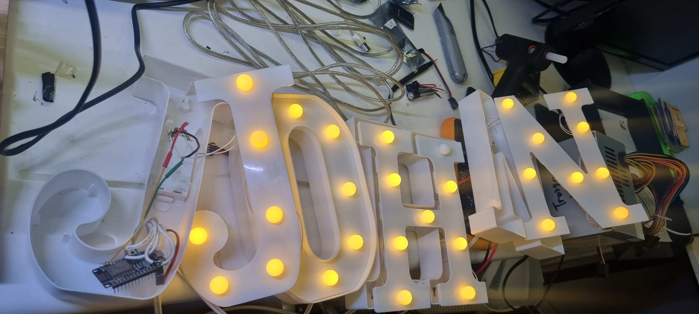
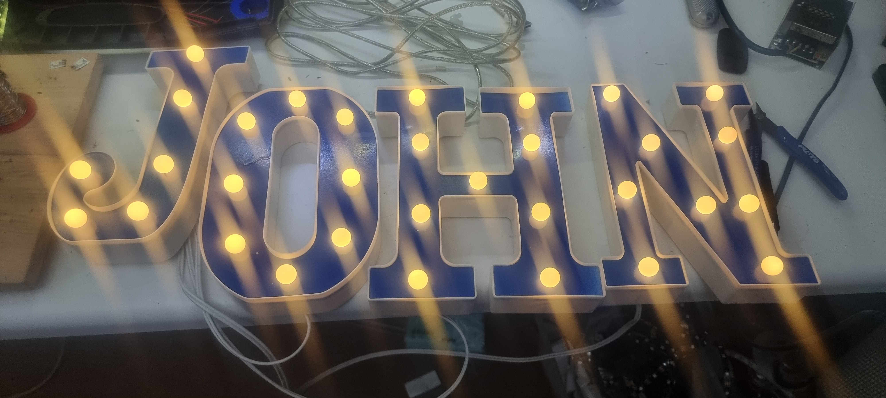
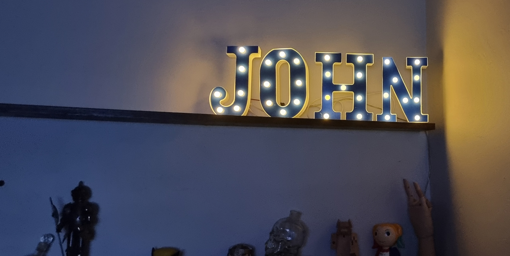

From

To

# Upgrade Your Letter Lights

You've probably seen these letter lights for sale, at about 100ZAR or 20USD. They can make good gifts, but there's a 
major drawback - they take 2 AA batteries, and these only last for so long. The lights inevitably become gimmick
gifts that end up gathering dust in a cupboard. 

After realising that the lights ran on  3V (2 x 1.5V AA batteries), I decided that there might be a way to make these 
better.

With an ESP8266 or ESP32, some soldering, and spray-paint, you can turn these letters into something special and 
useful.

- Control each letter individually
- Powered by standard USB charger
- No more batteries
- Manage with Home Assistant

## Parts Required

1. Letter lights
2. ESP32 or ESP8266
3. Soldering iron and kit
4. USB charger or alternate 5V power supply
5. Spray-paint
6. Multimeter - Optional but very handy 

## Let's Get Started

To open these lights up, take out the batteries and gently pull out the bulb covers. They should pop out with some care,
though you should be mindful that the connections for the LEDs to the wiring can be weak. If an LED pulls loose, you may 
need to resolder it back onto the wire.

Once the bulbs are off, you can pull the front cover off, taking care with the clips holding it on the plastic walls.

*You may find it easier to pull the front cover off first, as shown here. One of the LEDs did lose its connection, and 
had to be reattached later.

I used ESPHome to flash my ESP8266 unit, you can find the yaml code in letter-lights.yaml. Do bear in mind that the GPIO
pins specified in the file will vary depending on the board and number of letters you use. With the unit flashed, I 
could install and test it as I went.

> # Power Considerations
> 
> I was concerned that the bulbs may draw more power than the GPIO pins could provide. It turns out that the LEDs 
> use around .2mA each, while the GPIO pins are rated for 12mA, up to a combined maximum of 20mA. Since letters 
> seem to have a maximum of 9 LEDs, this means any letter is drawing a maximum of 1.8mA, which is well within range.
> 
>The ESP32 allows for a maximum per pin of 40mA, though 20mA is recommended.
> 
> The lights work at 3V, so if you're working on 12mA or less, you can use thin cable for this - 25AWG, or a single 
> strand of CAT5 cable can work. 

I mounted my ESP8266 in the first letter, which turned out to be a mistake - since power was coming from the right of
the letters, it meant the power cable had to run behind all of them to get to the first letter. 

You can use the built-in micro USB connector, though these connectors are liable to detach from the board or the USB 
cable might fall out. I cut open my USB cable, found the 5V and Gnd wires, and used these directly on the board instead.  

I connected each letter up, making sure to keep a common ground. I overspecced on my connecting cable, which ended
up being a bit stiff and difficult to comfortably fit the way I wanted (see 
[Power Considerations](#power-considerations)). With some patience, I was able to get each letter connected and working 
as expected. The letters I used had small mounting holes in the back that were ideal for running the wires inside each 
letter. 

By soldering the wires onto the switch and battery connector, it's possible to have the switch on the back work to 
switch off lights manually if needed. 

My order of cable connectors didn't arrive in time, so I made do without as I don't plan on moving this sign. The
right cable to connect the letters and actual connectors for each letter are definitely recommended!

A friend suggested spray-painting the cover, which made a big difference. I found that lightly sanding the cover first 
allowed the paint to adhere better, though I still ended up doing multiple coats to make it hold. 

The paint job wasn't perfect, but isn't noticeable when mounted. 

*Gunk on my camera lens is definitely noticeable though* 

Now I was happy that the lights were working and each letter was individually controllable, I started adding scripts 
that various automations could call in Home Assistant. Since we live in aa country with scheduled rolling blackouts (AKA 
load shedding), I wanted to alert people if we were running on backup power from the inverter. 

These scripts are attached as JohnSignPowerOn.yaml and JohnSignPowerOut.yaml